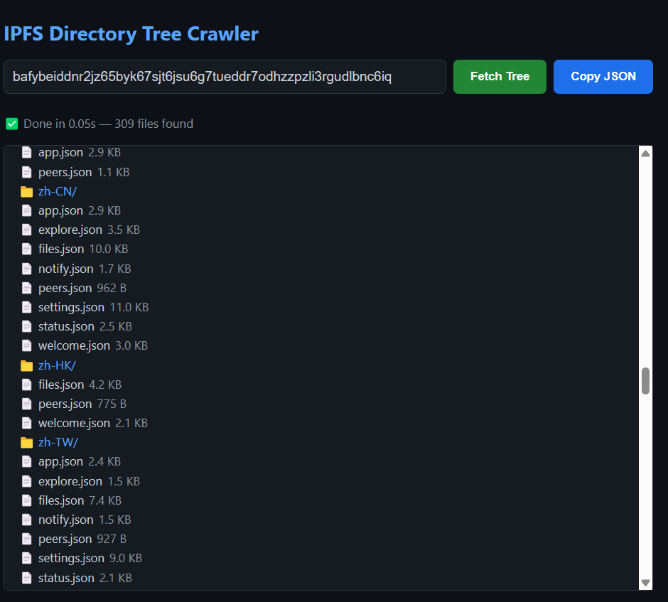

<div align="center">

# 🌳 IPFS Tree Crawler

**Convert IPFS Root CID to File Tree JSON — Fast, Secure & Browser-Native**

[](https://opensource.org/licenses/MIT)
[](https://www.rust-lang.org/)
[](https://webassembly.org/)
[](https://ipfs.tech/)

[Features](#-features) · [Tech Stack](#-tech-stack) · [Quick Start](#-quick-start) · [How It Works](#-how-it-works) · [Roadmap](#-roadmap) · [Contributing](#-contributing) · [License](#-license)

</div>

---

## ✨ Features

| Feature | Description |
|---------|-------------|
| 🚀 **Lightning-Fast Conversion** | Transform any IPFS Root CID into a structured file tree JSON in seconds |
| 🔒 **Trustless Security** | Leverages `trustless-gateway.link` for verifiable, integrity-guaranteed data retrieval |
| 🌐 **Zero Installation** | Runs entirely in your browser via WebAssembly — no server-side dependencies |
| 📊 **Clean Output** | Generates human-readable, machine-parsable JSON tree structures |
| ⚡ **Performance Optimized** | Built with Rust for maximum speed and memory safety |

---

## 🛠 Tech Stack

| Component | Technology | Purpose |
|-----------|-----------|---------|
| Core Language | **Rust** | High-performance, memory-safe implementation |
| Web Runtime | **WebAssembly** | Native-speed execution in browsers |
| Data Source | **IPFS Trustless Gateway** | Secure, verifiable content addressing |
| Output Format | **JSON** | Universal data interchange format |

### Architecture

```
┌─────────────────────────────────────────────────────┐
│                    Browser                          │
│                                                     │
│  ┌─────────────────────────────────────────────┐   │
│  │         WebAssembly (WASM) Module           │   │
│  │                                             │   │
│  │  ┌─────────────────────────────────────┐    │   │
│  │  │       Rust Core (Compiled)          │    │   │
│  │  │                                     │    │   │
│  │  │  • CID Parser                       │    │   │
│  │  │  • Tree Builder                     │    │   │
│  │  │  • JSON Serializer                  │    │   │
│  │  └─────────────────────────────────────┘    │   │
│  └─────────────────────────────────────────────┘   │
│                      ↕ HTTPS                       │
├─────────────────────────────────────────────────────┤
│         trustless-gateway.link (IPFS)               │
│                                                     │
│  • Content-addressed storage                        │
│  • Integrity verification                           │
│  • CAR stream / Raw block responses                 │
└─────────────────────────────────────────────────────┘
```

---

## 🚀 Quick Start

### Online Usage (Coming Soon)

Visit the live demo and paste your Root CID:

```bash
# Example: Convert an IPFS directory CID
Input:  QmS4ustL54uo8FzR9455qaxZwuMiUhyvMcX9Ba8nUH4uVv

Output:
[
    "",
    [
        ["about", 1677],
        ["contact", 189],
        ["help", 311],
        ["ping", 4],
        ["quick-start", 1681],
        ["readme", 1091],
        ["security-notes", 1162]
    ]
]
```

### Local Development (Post Open-Source)

```bash
# Clone the repository
git clone https://github.com/yourusername/ipfs-tree-crawler.git
cd ipfs-tree-crawler

# Build WASM module
# wasm-pack build --target web

# Serve locally
python -m http.server 8080
```

---

## 📖 How It Works

```
Input     →  User provides an IPFS Root CID (Content Identifier)
Fetch     →  Tool queries trustless-gateway.link/ipfs/{cid} via Trustless Gateway protocol
Parse     →  Rust WASM module parses CAR stream or raw blocks
Traverse  →  Recursively builds file/directory tree structure
Output    →  Returns formatted JSON representing the complete file hierarchy
```

### Why Trustless Gateway?

The [Trustless Gateway](https://specs.ipfs.tech/http-gateways/trustless-gateway/) specification allows lightweight IPFS clients to retrieve data behind a CID and verify its integrity **without delegating any trust to the gateway itself**. This ensures:

- ✅ **Data authenticity** — Cryptographic verification of every block
- ✅ **No single point of trust** — Gateway cannot tamper with data undetectably
- ✅ **Resistance to tampering or MITM attacks** — Provenance is built into the protocol

---

## 🗺 Roadmap

### Phase 1 — Current State 🔄

- ✅ Core Rust implementation
- ✅ WASM compilation & browser integration
- ✅ Basic CID → Tree conversion
- ⭐ **Goal:** 100 GitHub Stars to unlock open-source release

### Phase 2 — Post Open-Source 🔓

- Public repository with MIT/Apache-2.0 license
- CLI version (`cargo install ipfs-tree-crawler`)
- Advanced features:
  - Custom depth limiting
  - File size filtering
  - Multiple output formats (YAML, TOML, CSV)
  - Batch CID processing
- Comprehensive test suite (>90% coverage)

### Phase 3 — Ecosystem Integration 🌍

- VS Code extension
- Web component (`<ipfs-tree>`)
- Deno / Node.js bindings
- GraphQL API wrapper

---

## ❤️ Support This Project

We believe in transparent, community-driven development. The code will be open-sourced once we reach **100 Stars** on GitHub.

### How to Help

- ⭐ **Star this repository** — Every star brings us closer to open-source!
- 🐛 **Report issues** — Found a bug? Let us know!
- 💡 **Suggest features** — What would you like to see?
- 📢 **Spread the word** — Share with your IPFS / Web3 communities


---

## 🤝 Contributing

> **Note:** Contributions will be accepted after the official open-source release. In the meantime, please star the repo and join our waitlist!

### Future Contribution Guidelines

- Follow Rust's RFC process style for major changes
- Write tests for new features (`cargo test && wasm-pack test --headless`)
- Maintain backward compatibility for JSON output format
- Document public APIs with `rustdoc` comments

---

## 📄 License

This project will be released under the **MIT License** after reaching the star goal.

```
Copyright (c) 2026 IPFS Tree Crawler Contributors

Permission is hereby granted, free of charge, to any person obtaining a copy
of this software and associated documentation files (the "Software"), to deal
in the Software without restriction, including without limitation the rights
to use, copy, modify, merge, publish, distribute, sublicense, and/or sell
copies of the Software, and to permit persons to whom the Software is
furnished to do so, subject to the following conditions:

The above copyright notice and this permission notice shall be included in all
copies or substantial portions of the Software.

THE SOFTWARE IS PROVIDED "AS IS", WITHOUT WARRANTY OF ANY KIND, EXPRESS OR
IMPLIED, INCLUDING BUT NOT LIMITED TO THE WARRANTIES OF MERCHANTABILITY,
FITNESS FOR A PARTICULAR PURPOSE AND NONINFRINGEMENT. IN NO EVENT SHALL THE
AUTHORS OR COPYRIGHT HOLDERS BE LIABLE FOR ANY CLAIM, DAMAGES OR OTHER
LIABILITY, WHETHER IN AN ACTION OF CONTRACT, TORT OR OTHERWISE, ARISING FROM,
OUT OF OR IN CONNECTION WITH THE SOFTWARE OR THE USE OR OTHER DEALINGS IN THE
SOFTWARE.
```

---

## 🙏 Acknowledgments

- **[IPFS Team](https://ipfs.tech/)** — For the revolutionary peer-to-peer protocol
- **[Rust Community](https://www.rust-lang.org/community)** — For amazing tooling and `wasm-bindgen`
- **[Trustless Gateway Spec](https://specs.ipfs.tech/http-gateways/trustless-gateway/)** — Enabling secure light-client access

---

<div align="center">

**Made with 🦀 and ❤️ by the IPFS Community**

[⭐ Star now to unlock the source code!](https://github.com/einela/ipfs-tree-crawler)

</div>